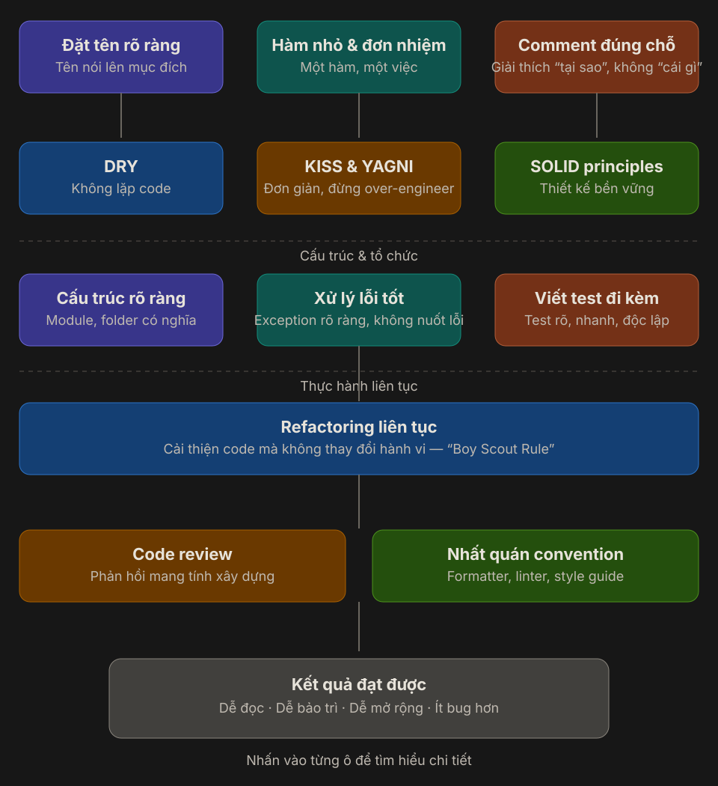

# Clean Code

Clean Code không có nghĩa là code phải ngắn nhất, dùng nhiều kỹ thuật nhất, hay trông “thông minh” nhất.  
Clean Code là code mà người khác có thể **đọc, hiểu, sửa, test và mở rộng** với chi phí thấp nhất có thể.



Sơ đồ thực tế về Clean Code:

1. Bắt đầu từ những thứ người đọc thấy đầu tiên: **tên rõ ràng, hàm nhỏ, comment đúng chỗ**.
2. Dùng các nguyên tắc để giữ code gọn và bền: **DRY, KISS, YAGNI, SOLID**.
3. Tổ chức code để hệ thống dễ sống lâu: **cấu trúc rõ, xử lý lỗi tốt, test đi kèm**.
4. Duy trì chất lượng bằng thói quen liên tục: **refactor, code review, convention nhất quán**.
5. Kết quả cuối cùng là code **dễ đọc, dễ bảo trì, dễ mở rộng và ít bug hơn**.

---

## 1. Đặt tên rõ ràng

Tên là lớp tài liệu đầu tiên của code. Một tên tốt giúp người đọc hiểu được mục đích mà không phải mở thêm nhiều file để đoán.

| Tên yếu     | Tên tốt hơn               |
| ----------- | ------------------------- |
| `data`      | `pendingOrders`           |
| `flag`      | `isPaymentConfirmed`      |
| `Process()` | `CalculateInvoiceTotal()` |
| `list`      | `expiredRefreshTokens`    |

Một tên tốt thường trả lời được:

- Đây là gì?
- Dùng để làm gì?
- Vì sao nó tồn tại?

Ví dụ:

```csharp
var activeOrders = orderRepository.GetActiveOrders(customerId);
var totalAmount = CalculateTotalAmount(activeOrders);
```

So với:

```csharp
var data = repo.Get(x);
var result = Handle(data);
```

Đoạn đầu dài hơn một chút, nhưng người đọc gần như không phải đoán.

---

## 2. Hàm nhỏ và đơn nhiệm

Một hàm tốt nên làm **một việc chính** và tên của nó phải mô tả đúng việc đó.

Hàm quá dài thường có các dấu hiệu:

- Validate input.
- Tính toán business rule.
- Gọi database.
- Gửi email.
- Ghi log.
- Tất cả nằm chung trong một method.

Ví dụ chưa tốt:

```csharp
public async Task CheckoutAsync(Guid customerId)
{
    var cart = await _cartRepository.GetAsync(customerId);

    if (cart == null || cart.Items.Count == 0)
    {
        throw new InvalidOperationException("Cart is empty");
    }

    var total = cart.Items.Sum(x => x.Price * x.Quantity);
    var order = new Order(customerId, total);

    await _orderRepository.AddAsync(order);
    await _emailSender.SendOrderCreatedAsync(customerId, order.Id);
}
```

Rõ hơn:

```csharp
public async Task CheckoutAsync(Guid customerId)
{
    var cart = await GetValidCartAsync(customerId);
    var total = CalculateTotal(cart);
    var order = CreateOrder(customerId, total);

    await _orderRepository.AddAsync(order);
    await _emailSender.SendOrderCreatedAsync(customerId, order.Id);
}
```

Mục tiêu không phải “hàm càng ngắn càng tốt”, mà là **mỗi hàm có một lý do rõ ràng để thay đổi**.

---

## 3. Comment đúng chỗ

Comment tốt giải thích **tại sao**.  
Comment yếu thường chỉ nhắc lại **code đang làm gì**.

Không hữu ích:

```csharp
// Increase count by 1
count++;
```

Hữu ích hơn:

```csharp
// Payment gateway may send duplicate callbacks, so this handler must be idempotent.
```

Nên dùng comment khi:

- Có workaround vì giới hạn kỹ thuật.
- Có quyết định đặc biệt do business rule.
- Có behavior dễ bị hiểu sai nếu chỉ nhìn code.

Nếu phải viết nhiều comment để giải thích một method đang làm gì, thường nên xem lại cách đặt tên hoặc cách tách hàm.

---

## 4. DRY — Không lặp logic

`DRY` là **Don’t Repeat Yourself**: một business rule không nên bị copy rải rác nhiều nơi.

Khi cùng một rule xuất hiện ở nhiều service:

- Sửa một nơi có thể quên nơi khác.
- Behavior dễ lệch nhau giữa các endpoint.
- Bug fix trở nên không đáng tin.

Tuy nhiên, DRY không có nghĩa là cứ thấy hai đoạn code giống nhau là gom ngay.

```text
Trùng logic thật -> nên gom.
Chỉ trùng hình dạng code -> quan sát thêm trước khi abstraction.
```

Abstraction sai thường còn khó sửa hơn duplicate nhỏ ban đầu.

---

## 5. KISS và YAGNI — Đơn giản trước, mở rộng khi cần

### KISS

`Keep It Simple, Stupid` nhắc rằng giải pháp đơn giản, rõ ràng thường tốt hơn giải pháp “linh hoạt” nhưng khó hiểu.

### YAGNI

`You Aren’t Gonna Need It` nhắc rằng đừng xây trước những thứ chưa có requirement thật.

Ví dụ:

- Chưa cần plugin architecture nếu app chỉ có một cách xử lý.
- Chưa cần generic framework nếu mới có một use case.
- Chưa cần nhiều tầng abstraction chỉ để “sau này có thể dùng”.

Một câu hỏi rất hữu ích:

```text
Mình đang giải quyết vấn đề hiện tại, hay đang tưởng tượng một vấn đề tương lai chưa chắc xảy ra?
```

---

## 6. SOLID — Thiết kế bền vững hơn

SOLID giúp code không chỉ dễ đọc hôm nay, mà còn dễ thay đổi về sau.

| Nguyên tắc | Ý nghĩa ngắn gọn                                             |
| ---------- | ------------------------------------------------------------ |
| SRP        | Một class nên có một lý do chính để thay đổi                 |
| OCP        | Mở rộng hành vi mà ít sửa code cũ                            |
| LSP        | Class con phải thay thế được class cha mà không phá behavior |
| ISP        | Interface nhỏ, đúng nhu cầu                                  |
| DIP        | Phụ thuộc abstraction thay vì concrete implementation        |

Clean Code và SOLID không tách rời nhau:

- Clean Code giúp code **dễ đọc**.
- SOLID giúp thiết kế **dễ thay đổi**.

---

## 7. Cấu trúc rõ ràng

Code sạch không chỉ nằm trong từng method. Cách bạn chia module, folder và layer cũng ảnh hưởng rất lớn tới khả năng maintain.

Một cấu trúc tốt giúp người mới vào project trả lời nhanh:

- API nằm ở đâu?
- Business rule nằm ở đâu?
- Data access nằm ở đâu?
- Integration với bên ngoài nằm ở đâu?

Ví dụ trong backend:

```text
Controller -> Application Service -> Domain -> Repository / Infrastructure
```

Nguyên tắc nên giữ:

- Controller mỏng.
- Business rule không bị rò vào controller hoặc repository.
- Folder/class name phản ánh domain thật, không chỉ phản ánh kỹ thuật.
- File liên quan nên nằm gần nhau để giảm chi phí tìm kiếm.

---

## 8. Xử lý lỗi tốt

Code sạch không chỉ đẹp ở happy path. Nó còn cần rõ ràng khi mọi thứ đi sai.

Nên:

- Throw exception có ý nghĩa.
- Không nuốt lỗi.
- Log đủ context để debug.
- Phân biệt lỗi business và lỗi kỹ thuật.
- Trả về message phù hợp cho client, không lộ chi tiết nhạy cảm.

Ví dụ tốt hơn:

```csharp
if (order is null)
{
    throw new OrderNotFoundException(orderId);
}
```

Thay vì:

```csharp
catch
{
    return null;
}
```

“Không crash” chưa chắc là tốt nếu hệ thống đang âm thầm che giấu lỗi.

---

## 9. Viết test đi kèm

Test là lớp bảo vệ cho refactor. Nếu không có test, code rất khó được cải thiện một cách tự tin.

Một bài test tốt nên:

- Rõ mục tiêu.
- Chạy nhanh.
- Độc lập.
- Dễ đọc.
- Chỉ fail vì đúng lý do nó đang kiểm tra.

Test giúp bạn:

- Tự tin sửa code.
- Phát hiện regression sớm.
- Tài liệu hóa behavior quan trọng.
- Tách business rule khỏi dependency bên ngoài tốt hơn.

Không phải mọi thứ đều cần unit test, nhưng flow quan trọng nên có một mức bảo vệ phù hợp: unit test, integration test hoặc end-to-end test.

---

## 10. Refactoring liên tục

Refactoring là cải thiện cấu trúc code **mà không đổi hành vi bên ngoài**.

Tư duy nên gần với “Boy Scout Rule”:

```text
Rời codebase ở trạng thái tốt hơn một chút so với lúc bạn bước vào.
```

Ví dụ refactor nhỏ:

- Đổi tên biến rõ hơn.
- Tách một method đang quá dài.
- Loại bỏ duplicate nhỏ.
- Thay magic number bằng constant.
- Gom validation lặp lại.

Refactor tốt thường là:

- Nhỏ.
- Có test bảo vệ.
- Gắn với nhu cầu thực tế.
- Không biến mỗi task nhỏ thành một cuộc đại tu kiến trúc.

---

## 11. Code review

Code review không chỉ để bắt lỗi cú pháp. Nó là nơi cả team giữ chuẩn chất lượng chung.

Một review tốt nên tập trung vào:

- Ý định của code có rõ không?
- Có edge case nào bị bỏ sót không?
- Có duplicate hay coupling tăng lên không?
- Test đã đủ chưa?
- Thiết kế có đang phức tạp hơn mức cần thiết không?

Phản hồi tốt là phản hồi:

- Cụ thể.
- Có lý do.
- Tập trung vào code, không công kích người viết.
- Ưu tiên mức độ ảnh hưởng thay vì bắt mọi tiểu tiết bằng tay.

---

## 12. Nhất quán convention

Convention giúp giảm “nhiễu” khi đọc code.

Nên thống nhất:

- Formatter.
- Linter.
- Naming convention.
- Cách tổ chức folder.
- Cách đặt tên test.
- Style guide cho exception, logging, response model.

Những thứ máy làm được thì nên để máy làm:

- Format tự động.
- Lint tự động.
- Check style trong CI.

Nhờ vậy, review có thể tập trung vào logic và thiết kế thay vì tranh luận khoảng trắng.

---

## 13. Kết quả đạt được

Khi những thực hành trên được duy trì cùng nhau, codebase thường đạt được:

- **Dễ đọc hơn**: người mới hiểu nhanh hơn.
- **Dễ bảo trì hơn**: bug fix ít làm vỡ chỗ khác.
- **Dễ mở rộng hơn**: thêm requirement mới ít đau hơn.
- **Ít bug hơn**: vì logic rõ, test tốt và review tốt hơn.

Đây là lý do Clean Code không chỉ là chuyện thẩm mỹ. Nó là một lợi thế vận hành của cả team.

---

## 14. Checklist tự kiểm tra

Trước khi merge, có thể tự hỏi:

1. Tên class, method, biến đã nói lên mục đích chưa?
2. Có method nào đang làm nhiều hơn một việc không?
3. Comment đang giải thích “tại sao” hay chỉ lặp lại code?
4. Có duplicate logic nào nên gom không?
5. Mình có đang over-engineer cho một nhu cầu chưa tồn tại không?
6. Cấu trúc file/module có giúp người khác tìm code nhanh không?
7. Error path có rõ ràng không?
8. Flow quan trọng đã có test bảo vệ chưa?
9. Đoạn code này có thể được refactor nhỏ thêm một bước không?
10. Code này có bám convention chung của team không?

---

## 15. Tóm tắt

Clean Code không phải một kỹ thuật đơn lẻ. Nó là tập hợp của:

- Cách viết code rõ ràng.
- Nguyên tắc thiết kế hợp lý.
- Cấu trúc có chủ đích.
- Thói quen cải thiện liên tục.
- Kỷ luật làm việc chung trong team.

```text
Code tốt không chỉ được máy hiểu.
Code tốt còn phải được con người hiểu nhanh và sửa an toàn.
```
