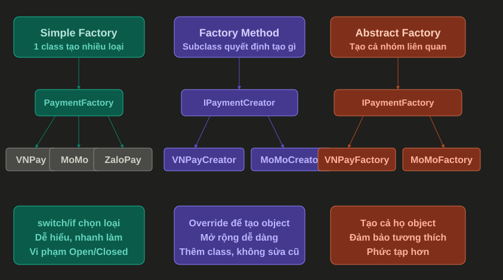

# Factory Pattern

## 1. Factory Pattern là gì?

Factory Pattern là một Creational Design Pattern dùng để tách logic khởi tạo object ra khỏi nơi sử dụng object đó.

Thay vì caller tự `new` class cụ thể, caller sẽ gọi một factory để nhận về object phù hợp.

Nói đơn giản:

```text
Caller cần object -> Factory quyết định tạo object nào -> Caller nhận object để dùng
```

Ví dụ thực tế:

- Tạo payment service theo phương thức thanh toán: momo, vnpay, credit card.
- Tạo notification sender theo kênh gửi: email, SMS, Telegram.
- Tạo export service theo định dạng file: PDF, Excel, CSV.
- Tạo parser theo loại dữ liệu đầu vào: JSON, XML, CSV.
- Tạo discount strategy theo loại khách hàng hoặc chương trình khuyến mãi.

---

## 2. Factory giải quyết vấn đề gì?

Trong ứng dụng, việc tạo object thường không chỉ đơn giản là `new`.

Đôi khi mình phải:

- Chọn class cụ thể dựa trên input.
- Truyền dependency vào object.
- Validate loại object cần tạo.
- Ẩn chi tiết khởi tạo khỏi caller.
- Tránh lặp lại nhiều đoạn `if else` hoặc `switch`.

Ví dụ chưa dùng Factory:

```csharp
public class PaymentService
{
    public void Pay(string paymentMethod, decimal amount)
    {
        if (paymentMethod == "momo")
        {
            var payment = new MomoPayment();
            payment.Pay(amount);
        }
        else if (paymentMethod == "vnpay")
        {
            var payment = new VnPayPayment();
            payment.Pay(amount);
        }
        else if (paymentMethod == "credit-card")
        {
            var payment = new CreditCardPayment();
            payment.Pay(amount);
        }
    }
}
```

Vấn đề:

- `PaymentService` vừa xử lý nghiệp vụ, vừa biết cách tạo từng loại payment.
- Khi thêm payment mới, phải sửa trực tiếp `PaymentService`.
- Logic tạo object có thể bị lặp lại ở nhiều nơi.
- Code dễ phình to khi số loại object tăng lên.

Factory giúp gom phần tạo object vào một nơi riêng:

```text
PaymentService -> PaymentFactory -> IPayment implementation
```

---

## 3. Đặc điểm chính

Một Factory thường có các đặc điểm:

- Che giấu logic tạo object khỏi caller.
- Trả về abstraction như interface hoặc abstract class.
- Chọn implementation cụ thể dựa trên input hoặc cấu hình.
- Giúp caller phụ thuộc vào abstraction thay vì class cụ thể.
- Dễ mở rộng hơn khi cần thêm loại object mới.

---

## 4. Ví dụ Factory cơ bản trong C#

Đầu tiên, tạo interface chung:

```csharp
public interface IPaymentProcessor
{
    void Pay(decimal amount);
}
```

Các implementation cụ thể:

```csharp
public class MomoPaymentProcessor : IPaymentProcessor
{
    public void Pay(decimal amount)
    {
        Console.WriteLine($"Paid {amount} using Momo");
    }
}

public class VnPayPaymentProcessor : IPaymentProcessor
{
    public void Pay(decimal amount)
    {
        Console.WriteLine($"Paid {amount} using VNPAY");
    }
}

public class CreditCardPaymentProcessor : IPaymentProcessor
{
    public void Pay(decimal amount)
    {
        Console.WriteLine($"Paid {amount} using Credit Card");
    }
}
```

Tạo Factory:

```csharp
public static class PaymentProcessorFactory
{
    public static IPaymentProcessor Create(string paymentMethod)
    {
        return paymentMethod switch
        {
            "momo" => new MomoPaymentProcessor(),
            "vnpay" => new VnPayPaymentProcessor(),
            "credit-card" => new CreditCardPaymentProcessor(),
            _ => throw new NotSupportedException($"Payment method '{paymentMethod}' is not supported")
        };
    }
}
```

Cách sử dụng:

```csharp
var paymentProcessor = PaymentProcessorFactory.Create("momo");

paymentProcessor.Pay(100_000);
```

Giải thích:

- `IPaymentProcessor` là abstraction mà caller sử dụng.
- `MomoPaymentProcessor`, `VnPayPaymentProcessor`, `CreditCardPaymentProcessor` là các object cụ thể.
- `PaymentProcessorFactory` chịu trách nhiệm chọn object cần tạo.
- Caller không cần biết class cụ thể được khởi tạo như thế nào.

---

## 5. Luồng hoạt động của Factory

Luồng cơ bản:

```text
Caller
  |
  | gọi Create(type)
  v
Factory
  |
  | kiểm tra type / input / config
  v
Concrete Object
  |
  | trả về dưới dạng interface
  v
Caller dùng object
```

Ví dụ với payment:

```text
OrderService gọi Create("momo")
        |
        v
PaymentProcessorFactory
        |
        v
new MomoPaymentProcessor()
        |
        v
trả về IPaymentProcessor
```

Điểm quan trọng:

- Caller chỉ biết mình cần `IPaymentProcessor`.
- Factory biết class cụ thể nào cần được tạo.
- Logic lựa chọn nằm tập trung ở factory.

---

## 6. Factory trong ASP.NET Core

Trong ASP.NET Core, mình thường kết hợp Factory với Dependency Injection để tránh tự `new` object có dependency phức tạp.

Ví dụ các payment processor có thể được đăng ký vào DI:

```csharp
builder.Services.AddScoped<MomoPaymentProcessor>();
builder.Services.AddScoped<VnPayPaymentProcessor>();
builder.Services.AddScoped<CreditCardPaymentProcessor>();
builder.Services.AddScoped<IPaymentProcessorFactory, PaymentProcessorFactory>();
```

Factory interface:

```csharp
public interface IPaymentProcessorFactory
{
    IPaymentProcessor Create(string paymentMethod);
}
```

Factory implementation:

```csharp
public class PaymentProcessorFactory : IPaymentProcessorFactory
{
    private readonly IServiceProvider _serviceProvider;

    public PaymentProcessorFactory(IServiceProvider serviceProvider)
    {
        _serviceProvider = serviceProvider;
    }

    public IPaymentProcessor Create(string paymentMethod)
    {
        return paymentMethod switch
        {
            "momo" => _serviceProvider.GetRequiredService<MomoPaymentProcessor>(),
            "vnpay" => _serviceProvider.GetRequiredService<VnPayPaymentProcessor>(),
            "credit-card" => _serviceProvider.GetRequiredService<CreditCardPaymentProcessor>(),
            _ => throw new NotSupportedException($"Payment method '{paymentMethod}' is not supported")
        };
    }
}
```

Sử dụng trong service:

```csharp
public class OrderService
{
    private readonly IPaymentProcessorFactory _paymentProcessorFactory;

    public OrderService(IPaymentProcessorFactory paymentProcessorFactory)
    {
        _paymentProcessorFactory = paymentProcessorFactory;
    }

    public void Checkout(string paymentMethod, decimal amount)
    {
        var paymentProcessor = _paymentProcessorFactory.Create(paymentMethod);

        paymentProcessor.Pay(amount);
    }
}
```

Điểm hay:

- `OrderService` không cần biết class payment cụ thể.
- Các payment processor vẫn được DI quản lý dependency.
- Logic chọn payment processor nằm trong factory.
- Khi thêm payment mới, mình sửa factory và đăng ký thêm service.

Lưu ý:

`IServiceProvider` không nên bị dùng tràn lan như Service Locator. Trong trường hợp Factory, dùng có kiểm soát để tạo object theo runtime input là chấp nhận được.

---

## 7. Khi nào nên dùng Factory?

Nên dùng Factory khi:

- Caller cần object nhưng không nên biết class cụ thể.
- Việc tạo object phụ thuộc vào input, config hoặc runtime condition.
- Có nhiều implementation cùng chung một interface.
- Logic khởi tạo object bị lặp lại ở nhiều nơi.
- Constructor của object phức tạp hoặc cần dependency.
- Muốn giảm `if else` / `switch` trong service chính.

Ví dụ phù hợp:

| Trường hợp | Có nên dùng Factory? | Ghi chú |
| ---------- | -------------------- | ------- |
| Chọn payment processor theo method | Có | Rất phù hợp |
| Chọn notification sender theo channel | Có | Email/SMS/Telegram |
| Chọn file exporter theo format | Có | PDF/Excel/CSV |
| Tạo object đơn giản chỉ có `new User()` | Không cần | Dùng trực tiếp đơn giản hơn |
| Object có nhiều field optional | Có thể không | Builder thường hợp hơn |
| Tạo service theo lifetime trong ASP.NET Core | Thường dùng DI | Không cần tự viết factory nếu DI đủ |

---

## 8. Khi nào không nên dùng Factory?

Không nên dùng Factory khi:

- Object rất đơn giản và không có logic chọn loại.
- Chỉ có một implementation duy nhất và chưa có nhu cầu mở rộng.
- Factory chỉ bọc lại `new` nhưng không đem lại giá trị gì.
- Dùng Factory làm code khó đọc hơn.
- Dùng Factory để che giấu dependency thay vì inject rõ ràng.
- Factory trở thành nơi chứa quá nhiều logic nghiệp vụ.

Ví dụ không nên:

```csharp
public static class UserFactory
{
    public static User Create(string name)
    {
        return new User(name);
    }
}
```

Nếu `User` chỉ đơn giản như vậy, viết trực tiếp sẽ rõ hơn:

```csharp
var user = new User(name);
```

Factory nên được dùng khi việc tạo object có quyết định, quy tắc hoặc độ phức tạp thật sự.

---

## 9. Các biến thể phổ biến

Sơ đồ dưới đây tóm tắt nhanh ba biến thể hay gặp khi nói về Factory:

<p align="center">
  
</p>

Ý nghĩa của sơ đồ:

- `Simple Factory`: một class dùng `switch` hoặc `if` để chọn object cần tạo. Dễ hiểu, nhanh làm, nhưng khi thêm loại mới thường phải sửa factory cũ.
- `Factory Method`: class cha định nghĩa phương thức tạo object, class con override để quyết định object cụ thể. Cách này mở rộng tốt hơn vì thêm class mới thay vì sửa nhiều code cũ.
- `Abstract Factory`: tạo cả một nhóm object liên quan với nhau. Phù hợp khi cần đảm bảo các object được tạo ra cùng một family, ví dụ bộ UI light/dark hoặc nhóm payment gateway liên quan.

Nói ngắn gọn:

```text
Simple Factory: một factory chọn nhiều loại object.
Factory Method: subclass quyết định tạo object nào.
Abstract Factory: một factory tạo cả họ object liên quan.
```

## 9.1 Simple Factory

Simple Factory là dạng đơn giản nhất: một class hoặc method chịu trách nhiệm chọn và tạo object dựa trên input.

Theo sơ đồ, `PaymentFactory` nhận loại payment như `vnpay`, `momo`, `zalopay`, sau đó dùng `switch` hoặc `if` để trả về object tương ứng.

Interface chung:

```csharp
public interface IPaymentProcessor
{
    void Pay(decimal amount);
}
```

Các payment processor cụ thể:

```csharp
public class VNPayProcessor : IPaymentProcessor
{
    public void Pay(decimal amount)
    {
        Console.WriteLine($"Paid {amount} using VNPay");
    }
}

public class MoMoProcessor : IPaymentProcessor
{
    public void Pay(decimal amount)
    {
        Console.WriteLine($"Paid {amount} using MoMo");
    }
}

public class ZaloPayProcessor : IPaymentProcessor
{
    public void Pay(decimal amount)
    {
        Console.WriteLine($"Paid {amount} using ZaloPay");
    }
}
```

Simple Factory:

```csharp
public static class PaymentFactory
{
    public static IPaymentProcessor Create(string paymentType)
    {
        return paymentType switch
        {
            "vnpay" => new VNPayProcessor(),
            "momo" => new MoMoProcessor(),
            "zalopay" => new ZaloPayProcessor(),
            _ => throw new NotSupportedException($"Payment type '{paymentType}' is not supported")
        };
    }
}
```

Cách dùng:

```csharp
var payment = PaymentFactory.Create("momo");

payment.Pay(100_000);
```

Đặc điểm:

- Dễ hiểu, nhanh làm.
- Phù hợp khi số loại object ít.
- Khi thêm payment mới, thường phải sửa `PaymentFactory`.
- Có thể vi phạm Open/Closed Principle nếu factory thay đổi liên tục.

---

## 9.2 Factory Method

Factory Method là pattern chính thức trong nhóm GoF. Nó cho phép class cha hoặc interface định nghĩa method tạo object, còn class con quyết định object cụ thể sẽ được tạo.

Theo sơ đồ, `IPaymentCreator` định nghĩa method tạo payment processor. `VNPayCreator` và `MoMoCreator` sẽ override hoặc implement method đó để tạo object riêng.

Product interface:

```csharp
public interface IPaymentProcessor
{
    void Pay(decimal amount);
}
```

Concrete products:

```csharp
public class VNPayProcessor : IPaymentProcessor
{
    public void Pay(decimal amount)
    {
        Console.WriteLine($"Paid {amount} using VNPay");
    }
}

public class MoMoProcessor : IPaymentProcessor
{
    public void Pay(decimal amount)
    {
        Console.WriteLine($"Paid {amount} using MoMo");
    }
}
```

Creator:

```csharp
public interface IPaymentCreator
{
    IPaymentProcessor CreatePaymentProcessor();
}
```

Concrete creators:

```csharp
public class VNPayCreator : IPaymentCreator
{
    public IPaymentProcessor CreatePaymentProcessor()
    {
        return new VNPayProcessor();
    }
}

public class MoMoCreator : IPaymentCreator
{
    public IPaymentProcessor CreatePaymentProcessor()
    {
        return new MoMoProcessor();
    }
}
```

Cách dùng:

```csharp
IPaymentCreator creator = new VNPayCreator();

var paymentProcessor = creator.CreatePaymentProcessor();

paymentProcessor.Pay(250_000);
```

Giải thích:

- `IPaymentCreator` định nghĩa factory method để tạo payment processor.
- `CreatePaymentProcessor()` là factory method.
- `VNPayCreator` quyết định tạo `VNPayProcessor`.
- `MoMoCreator` quyết định tạo `MoMoProcessor`.
- Khi thêm payment mới, có thể thêm creator mới thay vì sửa creator cũ.

Điểm khác với Simple Factory:

```text
Simple Factory: một class có switch/if để chọn loại.
Factory Method: mỗi subclass tự quyết định object mà nó tạo.
```

---

## 9.3 Abstract Factory

Abstract Factory dùng để tạo cả một họ object liên quan với nhau, không chỉ một object đơn lẻ.

Theo sơ đồ, `IPaymentFactory` không chỉ tạo payment processor, mà có thể tạo nhiều object cùng thuộc một payment provider, ví dụ:

- Processor để thanh toán.
- Refund service để hoàn tiền.
- Transaction verifier để kiểm tra giao dịch.

Các product interfaces:

```csharp
public interface IPaymentProcessor
{
    void Pay(decimal amount);
}

public interface IRefundProcessor
{
    void Refund(string transactionId);
}
```

VNPay product family:

```csharp
public class VNPayProcessor : IPaymentProcessor
{
    public void Pay(decimal amount)
    {
        Console.WriteLine($"Paid {amount} using VNPay");
    }
}

public class VNPayRefundProcessor : IRefundProcessor
{
    public void Refund(string transactionId)
    {
        Console.WriteLine($"Refund VNPay transaction {transactionId}");
    }
}
```

MoMo product family:

```csharp
public class MoMoProcessor : IPaymentProcessor
{
    public void Pay(decimal amount)
    {
        Console.WriteLine($"Paid {amount} using MoMo");
    }
}

public class MoMoRefundProcessor : IRefundProcessor
{
    public void Refund(string transactionId)
    {
        Console.WriteLine($"Refund MoMo transaction {transactionId}");
    }
}
```

Abstract factory interface:

```csharp
public interface IPaymentFactory
{
    IPaymentProcessor CreatePaymentProcessor();
    IRefundProcessor CreateRefundProcessor();
}
```

Concrete factories:

```csharp
public class VNPayFactory : IPaymentFactory
{
    public IPaymentProcessor CreatePaymentProcessor()
    {
        return new VNPayProcessor();
    }

    public IRefundProcessor CreateRefundProcessor()
    {
        return new VNPayRefundProcessor();
    }
}

public class MoMoFactory : IPaymentFactory
{
    public IPaymentProcessor CreatePaymentProcessor()
    {
        return new MoMoProcessor();
    }

    public IRefundProcessor CreateRefundProcessor()
    {
        return new MoMoRefundProcessor();
    }
}
```

Cách dùng:

```csharp
IPaymentFactory factory = new VNPayFactory();

var paymentProcessor = factory.CreatePaymentProcessor();
var refundProcessor = factory.CreateRefundProcessor();

paymentProcessor.Pay(300_000);
refundProcessor.Refund("TXN-001");
```

Giải thích:

- `IPaymentFactory` tạo một nhóm object liên quan.
- `VNPayFactory` tạo các object thuộc họ VNPay.
- `MoMoFactory` tạo các object thuộc họ MoMo.
- Caller không trộn nhầm `VNPayProcessor` với `MoMoRefundProcessor`.

Điểm khác với Factory Method:

```text
Factory Method: mỗi creator thường tạo một loại object chính.
Abstract Factory: mỗi factory tạo cả một bộ object liên quan.
```

---

## 10. Factory khác gì Builder và Abstract Factory?

| Tiêu chí | Factory | Builder | Abstract Factory |
| -------- | ------- | ------- | ---------------- |
| Mục đích chính | Chọn và tạo object phù hợp | Tạo object phức tạp từng bước | Tạo một họ object liên quan |
| Khi dùng | Có nhiều implementation cùng interface | Object có nhiều field hoặc cấu hình | Cần tạo nhiều object cùng một style/family |
| Caller quan tâm gì? | Cần loại object nào | Cần object được cấu hình ra sao | Cần bộ object nào |
| Ví dụ | PaymentFactory | EmailMessageBuilder | UIComponentFactory |
| Dấu hiệu nhận biết | `Create(type)` | `WithX().WithY().Build()` | `CreateButton()`, `CreateTextbox()` |

Ví dụ dễ nhớ:

```text
Factory: Tôi cần payment theo loại "momo".
Builder: Tôi cần tạo email với subject, body, cc, attachments.
Abstract Factory: Tôi cần tạo cả bộ UI cho theme Light hoặc Dark.
```

---

## 11. Ưu điểm

- Tách logic tạo object khỏi logic nghiệp vụ.
- Giúp caller phụ thuộc vào abstraction.
- Giảm code `new` rải rác ở nhiều nơi.
- Dễ thay đổi implementation cụ thể.
- Dễ gom validation khi tạo object.
- Dễ kết hợp với Dependency Injection.

---

## 12. Nhược điểm

- Có thể làm code phức tạp hơn nếu object quá đơn giản.
- Thêm class/method mới vào codebase.
- Nếu dùng `switch` lớn, factory vẫn phải sửa khi thêm loại mới.
- Nếu factory chứa nhiều logic nghiệp vụ, nó dễ trở thành class quá tải.
- Nếu lạm dụng `IServiceProvider`, code có thể giống Service Locator.

---

## 13. Lưu ý khi sử dụng

Checklist trước khi dùng Factory:

```text
1. Có nhiều implementation cùng chung interface không?
2. Việc tạo object có phụ thuộc input/config/runtime không?
3. Logic tạo object có đang bị lặp lại nhiều nơi không?
4. Caller có cần bị tách khỏi class cụ thể không?
5. Factory có đang chứa business logic quá nhiều không?
6. Có thể dùng DI trực tiếp thay vì tự viết Factory không?
```

Một số nguyên tắc thực tế:

- Factory nên tập trung vào việc tạo object, không nên xử lý nghiệp vụ chính.
- Nên trả về interface hoặc abstract class.
- Nên validate input và throw exception rõ ràng khi type không hỗ trợ.
- Nếu object có dependency, ưu tiên kết hợp Factory với DI.
- Không dùng Factory chỉ để bọc một dòng `new` đơn giản.
- Không để Factory biến thành Service Locator tổng hợp mọi service trong hệ thống.

---

## 14. Ví dụ thực tế: Notification Sender

Giả sử hệ thống cần gửi thông báo qua nhiều kênh.

Interface:

```csharp
public interface INotificationSender
{
    Task SendAsync(string receiver, string message);
}
```

Implementations:

```csharp
public class EmailNotificationSender : INotificationSender
{
    public Task SendAsync(string receiver, string message)
    {
        Console.WriteLine($"Send email to {receiver}: {message}");
        return Task.CompletedTask;
    }
}

public class SmsNotificationSender : INotificationSender
{
    public Task SendAsync(string receiver, string message)
    {
        Console.WriteLine($"Send SMS to {receiver}: {message}");
        return Task.CompletedTask;
    }
}

public class TelegramNotificationSender : INotificationSender
{
    public Task SendAsync(string receiver, string message)
    {
        Console.WriteLine($"Send Telegram message to {receiver}: {message}");
        return Task.CompletedTask;
    }
}
```

Factory:

```csharp
public interface INotificationSenderFactory
{
    INotificationSender Create(string channel);
}

public class NotificationSenderFactory : INotificationSenderFactory
{
    private readonly IServiceProvider _serviceProvider;

    public NotificationSenderFactory(IServiceProvider serviceProvider)
    {
        _serviceProvider = serviceProvider;
    }

    public INotificationSender Create(string channel)
    {
        return channel switch
        {
            "email" => _serviceProvider.GetRequiredService<EmailNotificationSender>(),
            "sms" => _serviceProvider.GetRequiredService<SmsNotificationSender>(),
            "telegram" => _serviceProvider.GetRequiredService<TelegramNotificationSender>(),
            _ => throw new NotSupportedException($"Notification channel '{channel}' is not supported")
        };
    }
}
```

Đăng ký DI:

```csharp
builder.Services.AddScoped<EmailNotificationSender>();
builder.Services.AddScoped<SmsNotificationSender>();
builder.Services.AddScoped<TelegramNotificationSender>();
builder.Services.AddScoped<INotificationSenderFactory, NotificationSenderFactory>();
```

Sử dụng:

```csharp
public class NotificationService
{
    private readonly INotificationSenderFactory _senderFactory;

    public NotificationService(INotificationSenderFactory senderFactory)
    {
        _senderFactory = senderFactory;
    }

    public async Task SendAsync(string channel, string receiver, string message)
    {
        var sender = _senderFactory.Create(channel);

        await sender.SendAsync(receiver, message);
    }
}
```

Điểm hay:

- `NotificationService` không cần biết gửi email, SMS hay Telegram được tạo thế nào.
- Thêm kênh mới không làm thay đổi flow chính của `NotificationService`.
- Các sender vẫn có thể inject dependency riêng như `HttpClient`, config hoặc logger.

---

## 15. Ví dụ sai thường gặp

```csharp
public class ApplicationFactory
{
    public OrderService CreateOrderService()
    {
        return new OrderService(
            new OrderRepository(),
            new PaymentService(),
            new EmailService()
        );
    }

    public ProductService CreateProductService()
    {
        return new ProductService(
            new ProductRepository(),
            new CacheService()
        );
    }

    public UserService CreateUserService()
    {
        return new UserService(
            new UserRepository(),
            new EmailService()
        );
    }
}
```

Vấn đề:

- Factory đang tự tạo gần như toàn bộ dependency của app.
- Khó kiểm soát lifetime của object.
- Khó test và khó thay implementation.
- Dễ thay thế sai vai trò của DI container.
- Khi hệ thống lớn lên, class này sẽ phình rất nhanh.

Cách tốt hơn:

- Dùng DI container để quản lý dependency.
- Chỉ tạo factory cho các object cần chọn implementation theo runtime input.
- Không gom toàn bộ service creation vào một factory tổng.

---

## 16. Tóm tắt

Factory Pattern dùng để tách logic tạo object ra khỏi nơi sử dụng object.

Nên nhớ:

- Factory phù hợp khi có nhiều implementation cùng một abstraction.
- Factory giúp gom logic chọn object vào một nơi.
- Trong ASP.NET Core, nên kết hợp Factory với Dependency Injection.
- Không dùng Factory chỉ để bọc một dòng `new` đơn giản.
- Factory không nên chứa business logic chính.

Một câu dễ nhớ:

```text
Factory tốt khi caller cần object nhưng không nên biết object cụ thể được tạo thế nào.
Factory xấu khi nó chỉ làm code dài hơn mà không che giấu được logic khởi tạo có ý nghĩa.
```
