# Facade Pattern

## 1. Facade Pattern là gì?

Facade Pattern là một **Structural Design Pattern** dùng để cung cấp một interface đơn giản hơn cho một hệ thống con đang có nhiều thành phần phức tạp bên trong.

Thay vì để client phải tự gọi từng service nhỏ theo đúng thứ tự, Facade gom các bước đó lại sau một API dễ dùng hơn.

Nói đơn giản:

```text
Nhiều service con phức tạp -> Facade gom lại -> client chỉ gọi một điểm vào đơn giản
```

Ví dụ thực tế:

- Đặt vé xem phim: kiểm tra suất chiếu, kiểm tra ghế, áp mã giảm giá, thanh toán, tạo vé, gửi email.
- Checkout đơn hàng: kiểm tra giỏ hàng, giữ tồn kho, thanh toán, tạo đơn, gửi thông báo.
- Xuất báo cáo: lấy dữ liệu, lọc, format, render file, upload storage.
- Đăng ký tài khoản: tạo user, tạo profile, gửi email xác thực, ghi audit log.

Facade không thay thế các service con. Nó chỉ tạo một **lối vào đơn giản hơn** để client sử dụng chúng đúng cách.

---

## 2. Facade giải quyết vấn đề gì?

Giả sử màn hình đặt vé xem phim cần thực hiện nhiều bước:

1. Kiểm tra suất chiếu còn tồn tại.
2. Kiểm tra ghế còn trống.
3. Tính giá sau khuyến mãi.
4. Thực hiện thanh toán.
5. Tạo vé.
6. Gửi email xác nhận.

Nếu controller hoặc client phải tự gọi tất cả service:

```csharp
public sealed class BookingController
{
    private readonly SeatService _seatService;
    private readonly SeatLockService _seatLockService;
    private readonly PricingService _pricingService;
    private readonly DiscountService _discountService;
    private readonly PaymentService _paymentService;
    private readonly TicketPdfService _ticketPdfService;
    private readonly EmailService _emailService;

    public async Task<IActionResult> BookAsync(BookingRequest request)
    {
        await _seatService.EnsureAvailableAsync(request.ShowtimeId, request.SeatIds);
        await _seatLockService.LockAsync(request.ShowtimeId, request.SeatIds);

        var basePrice = await _pricingService.CalculateAsync(request);
        var finalPrice = await _discountService.ApplyAsync(basePrice, request.CouponCode);

        await _paymentService.PayAsync(request.UserId, finalPrice);

        var ticket = await _ticketPdfService.GenerateAsync(request);
        await _emailService.SendTicketAsync(request.Email, ticket);

        return Ok();
    }
}
```

Vấn đề:

- Controller biết quá nhiều chi tiết của hệ thống con.
- Thứ tự xử lý bị lộ ra ngoài nơi đáng lẽ chỉ nên điều phối request.
- Nếu flow đổi, nhiều nơi gọi phải sửa theo.
- Khó tái sử dụng cùng một quy trình ở API, background job hoặc admin tool.
- Test controller trở nên nặng vì phải mock quá nhiều dependency.

Facade gom luồng đó vào một class có ý nghĩa nghiệp vụ rõ hơn:

```text
BookingController -> BookingFacade -> các service con
```

Khi đó client chỉ cần biết: “muốn đặt vé thì gọi `BookAsync`”.

Nếu bạn quen với mô hình 3 lớp:

```text
Controller -> BLL / Service Layer -> DAO / Repository
```

thì `BookingFacade` trong ví dụ này có thể rất giống một class ở **BLL / Service Layer**:

- `Controller` chỉ nhận request và trả response.
- `BLL` điều phối flow nghiệp vụ.
- `DAO` hoặc các service chuyên biệt xử lý phần việc nhỏ hơn như tồn kho, khuyến mãi, thanh toán, gửi email.

Điểm quan trọng là:

```text
Service Layer là vị trí của class trong kiến trúc.
Facade là vai trò mà class đó đang đóng trong thiết kế.
```

Một class ở BLL hoàn toàn có thể đồng thời là Facade nếu nó che nhiều subsystem phía sau một API đơn giản.

---

## 3. Cấu trúc cơ bản của Facade

Một implementation Facade thường có ba phần:

| Thành phần | Vai trò |
| --- | --- |
| Client | Nơi muốn sử dụng một nghiệp vụ ở mức cao |
| Facade | Cung cấp API đơn giản, điều phối các bước cần thiết |
| Subsystems | Các service con thực hiện từng phần việc chuyên biệt |

Trong ví dụ rạp phim:

```text
Client
  -> BookingFacade
      -> SeatService
      -> SeatLockService
      -> PricingService
      -> DiscountService
      -> PaymentService
      -> TicketPdfService
      -> EmailService
```

<p align="center">
  
</p>

Trong sơ đồ trên:

- `Client` chỉ làm việc với `BookingFacade`.
- `BookingFacade` là điểm vào cấp cao cho use case đặt vé.
- Các service phía sau vẫn tách riêng trách nhiệm, nhưng chi tiết phối hợp được che khỏi client.

---

## 4. Ví dụ Facade trong C#

### Bước 1: Các service con

```csharp
public sealed class SeatService
{
    public Task EnsureAvailableAsync(Guid showtimeId, IReadOnlyCollection<string> seatIds)
    {
        return Task.CompletedTask;
    }
}

public sealed class SeatLockService
{
    public Task LockAsync(Guid showtimeId, IReadOnlyCollection<string> seatIds)
    {
        return Task.CompletedTask;
    }
}

public sealed class PricingService
{
    public Task<decimal> CalculateAsync(BookingRequest request)
    {
        return Task.FromResult(240_000m);
    }
}

public sealed class DiscountService
{
    public Task<decimal> ApplyAsync(decimal amount, string? couponCode)
    {
        return Task.FromResult(amount);
    }
}

public sealed class PaymentService
{
    public Task PayAsync(Guid userId, decimal amount)
    {
        return Task.CompletedTask;
    }
}

public sealed class TicketPdfService
{
    public Task<byte[]> GenerateAsync(BookingRequest request)
    {
        return Task.FromResult(Array.Empty<byte>());
    }
}

public sealed class EmailService
{
    public Task SendTicketAsync(string email, byte[] ticketPdf)
    {
        return Task.CompletedTask;
    }
}
```

### Bước 2: Facade điều phối flow

```csharp
public sealed class BookingFacade
{
    private readonly SeatService _seatService;
    private readonly SeatLockService _seatLockService;
    private readonly PricingService _pricingService;
    private readonly DiscountService _discountService;
    private readonly PaymentService _paymentService;
    private readonly TicketPdfService _ticketPdfService;
    private readonly EmailService _emailService;

    public BookingFacade(
        SeatService seatService,
        SeatLockService seatLockService,
        PricingService pricingService,
        DiscountService discountService,
        PaymentService paymentService,
        TicketPdfService ticketPdfService,
        EmailService emailService)
    {
        _seatService = seatService;
        _seatLockService = seatLockService;
        _pricingService = pricingService;
        _discountService = discountService;
        _paymentService = paymentService;
        _ticketPdfService = ticketPdfService;
        _emailService = emailService;
    }

    public async Task BookAsync(BookingRequest request)
    {
        await _seatService.EnsureAvailableAsync(request.ShowtimeId, request.SeatIds);
        await _seatLockService.LockAsync(request.ShowtimeId, request.SeatIds);

        var basePrice = await _pricingService.CalculateAsync(request);
        var finalPrice = await _discountService.ApplyAsync(basePrice, request.CouponCode);

        await _paymentService.PayAsync(request.UserId, finalPrice);

        var ticketPdf = await _ticketPdfService.GenerateAsync(request);
        await _emailService.SendTicketAsync(request.Email, ticketPdf);
    }
}
```

### Bước 3: Client sử dụng Facade

```csharp
public sealed class BookingController
{
    private readonly BookingFacade _bookingFacade;

    public BookingController(BookingFacade bookingFacade)
    {
        _bookingFacade = bookingFacade;
    }

    [HttpPost]
    public async Task<IActionResult> BookAsync(BookingRequest request)
    {
        await _bookingFacade.BookAsync(request);

        return Ok();
    }
}
```

Kết quả:

- Controller ngắn hơn.
- Flow đặt vé nằm ở một nơi dễ đọc.
- Các service con vẫn giữ đúng trách nhiệm riêng.
- Khi quy trình thay đổi, thường chỉ cần sửa Facade thay vì sửa mọi client.

---

## 5. Luồng hoạt động của Facade

<p align="center">
  
</p>

Luồng trên thể hiện một điểm quan trọng: Facade thường phù hợp với các **use case có nhiều bước nối tiếp**.

Ví dụ trong `BookAsync`:

1. Kiểm tra ghế.
2. Giữ ghế.
3. Tính giá.
4. Áp khuyến mãi.
5. Thanh toán.
6. Sinh vé.
7. Gửi email.

Client chỉ thấy một hành động cấp cao là “đặt vé”, còn các bước nhỏ được giấu phía sau.

---

## 6. Facade trong ASP.NET Core / Clean Architecture

Trong ứng dụng ASP.NET Core, Facade thường xuất hiện dưới dạng một class ở **Application layer** hoặc **Service layer**, nơi mình cần điều phối nhiều thành phần để hoàn thành một use case.

Nói cách khác, khi code của bạn đã có:

```text
Controller -> BLL / Application Service -> Repository / DAO / External Service
```

thì nhiều khi **BLL/Application Service chính là nơi đóng vai trò Facade**.

Ví dụ:

```text
BookingController
  -> BookingService / BookingFacade
      -> SeatService
      -> PricingService
      -> PaymentService
      -> TicketService
      -> EmailService
```

Nếu `BookingService` cung cấp một method cấp cao như `BookAsync()` và che toàn bộ chi tiết điều phối phía sau, thì về mặt kiến trúc nó là **service layer**, còn về mặt pattern nó đang đóng vai trò **Facade**.

Ví dụ đăng ký DI:

```csharp
builder.Services.AddScoped<SeatService>();
builder.Services.AddScoped<SeatLockService>();
builder.Services.AddScoped<PricingService>();
builder.Services.AddScoped<DiscountService>();
builder.Services.AddScoped<PaymentService>();
builder.Services.AddScoped<TicketPdfService>();
builder.Services.AddScoped<EmailService>();
builder.Services.AddScoped<BookingFacade>();
```

Một cách nhìn hợp lý:

```text
Presentation layer
  -> gọi Facade / Application service

Application layer
  -> điều phối use case

Domain / Infrastructure services
  -> xử lý từng phần việc chuyên biệt
```

Facade đặc biệt hữu ích khi:

- Controller đang gọi quá nhiều service.
- Một use case có thứ tự bước cố định.
- Cùng một flow cần dùng lại ở nhiều điểm vào khác nhau.
- Muốn giữ cho presentation layer mỏng và dễ test hơn.
- Muốn BLL là nơi gom quy trình nghiệp vụ thay vì để controller phải hiểu từng subsystem.

---

## 7. Khi nào nên dùng Facade?

| Trường hợp | Có nên dùng? | Ghi chú |
| --- | --- | --- |
| Một nghiệp vụ phải gọi nhiều service con theo thứ tự | Có | Checkout, booking, onboarding |
| Muốn cung cấp API đơn giản cho hệ thống con phức tạp | Có | Client không cần biết chi tiết bên trong |
| Nhiều client đang lặp lại cùng một flow orchestration | Có | Gom flow vào một nơi |
| Muốn giảm coupling giữa controller và subsystem | Có | Controller chỉ phụ thuộc vào Facade |
| Chỉ có một hành động rất nhỏ, gọi một service duy nhất | Chưa cần | Facade có thể thừa |
| Muốn đổi interface không tương thích của thư viện ngoài | Không hẳn | Trường hợp này thường là Adapter |

---

## 8. Khi nào không nên dùng Facade?

Không nên dùng Facade chỉ vì:

- Muốn có thêm một class “cho đẹp kiến trúc”.
- Mỗi method chỉ gọi đúng một service con rồi pass-through.
- Bản thân flow vẫn còn rất đơn giản.
- Mình đang nhồi toàn bộ business logic vào một class khổng lồ.

Ví dụ Facade dùng sai:

```csharp
public sealed class UserFacade
{
    public Task<User> GetByIdAsync(Guid id)
    {
        return _userRepository.GetByIdAsync(id);
    }

    public Task CreateAsync(User user)
    {
        return _userRepository.CreateAsync(user);
    }

    public Task UpdateAsync(User user)
    {
        return _userRepository.UpdateAsync(user);
    }
}
```

Nếu `UserFacade` chỉ chuyển lời gọi từ controller sang repository mà không đơn giản hóa điều gì, nó chỉ tạo thêm một lớp trung gian không có giá trị.

---

## 9. Facade khác gì Adapter?

| Tiêu chí | Facade | Adapter |
| --- | --- | --- |
| Mục tiêu chính | Đơn giản hóa cách dùng một hệ thống con phức tạp | Chuyển một interface không tương thích thành interface mong muốn |
| Câu hỏi nó trả lời | “Làm sao gọi hệ thống này dễ hơn?” | “Làm sao hai interface khác nhau làm việc với nhau?” |
| Phạm vi | Thường bao quanh nhiều class/service | Thường bao quanh một class/API |
| Ví dụ | `BookingFacade` gọi pricing, payment, ticket, email | `TelegramNotificationAdapter` bọc SDK Telegram thành `INotificationSender` |

Một cách nhớ nhanh:

```text
Adapter đổi giao diện.
Facade đơn giản hóa cách sử dụng.
```

---

## 10. Facade khác gì với Service Layer / Application Service?

Trong nhiều codebase .NET, hai khái niệm này rất dễ bị nhìn như một vì chúng thường xuất hiện cùng một chỗ trong code.

| Tiêu chí | Facade | Service Layer / Application Service |
| --- | --- | --- |
| Bản chất | Design Pattern | Architectural Layer / vai trò trong kiến trúc |
| Trả lời câu hỏi | "Làm sao dùng hệ thống con này đơn giản hơn?" | "Logic nghiệp vụ của ứng dụng nên đặt ở đâu?" |
| Trọng tâm | Che sự phức tạp phía sau một API đơn giản | Điều phối use case, transaction, rule nghiệp vụ ở tầng ứng dụng |
| Ví dụ | `PaymentGatewayFacade`, `ReportingFacade` | `OrderService`, `BookingService`, `RegisterUserUseCase` |

Trong thực tế:

- Nếu class chủ yếu **che sự phức tạp của subsystem**, gọi là Facade rất hợp.
- Nếu class là nơi **định nghĩa use case nghiệp vụ chính**, tên `ApplicationService`, `BLL Service` hoặc `UseCase` thường diễn đạt rõ hơn.
- Một class có thể là **cả hai cùng lúc**:
  - về kiến trúc: nó thuộc `Service Layer`
  - về thiết kế: nó đóng vai trò `Facade`

Đừng quá bám vào tên. Quan trọng là class có đang thực sự:

- làm API dễ dùng hơn,
- giảm coupling,
- và gom orchestration hợp lý hay không.

Ví dụ:

```csharp
public sealed class BookingService
{
    public Task BookAsync(BookingRequest request)
    {
        // Điều phối seat, pricing, payment, ticket, email
    }
}
```

Nếu `BookingService` là nơi xử lý use case đặt vé trong BLL, nó là **service layer**.

Nếu cùng lúc nó che toàn bộ các bước con phía sau method `BookAsync()`, nó cũng đang đóng vai trò **Facade**.

---

## 11. Ưu điểm

- Làm API phía client đơn giản hơn.
- Giảm coupling giữa client và các service con.
- Gom flow nhiều bước vào một nơi dễ đọc.
- Dễ tái sử dụng cùng một quy trình ở nhiều entry point.
- Giúp controller mỏng hơn và dễ test hơn.
- Có thể đóng vai trò ranh giới rõ giữa module bên ngoài và subsystem bên trong.

---

## 12. Nhược điểm

- Nếu lạm dụng, dễ tạo “God Facade” biết quá nhiều thứ.
- Có thể che giấu quá mức, khiến client không còn quyền dùng tính năng nâng cao khi thực sự cần.
- Nếu subsystem thay đổi thường xuyên, Facade cũng phải cập nhật theo.
- Dễ bị nhầm với service layer thông thường nếu không có tiêu chí rõ.

---

## 13. Lưu ý khi dùng

- Facade nên **điều phối**, không nên ôm hết business rule chi tiết.
- Tên method nên thể hiện một hành động cấp cao: `CheckoutAsync`, `BookAsync`, `RegisterAsync`.
- Nếu flow quá lớn, hãy tách bớt thành các collaborator nhỏ thay vì để Facade phình vô hạn.
- Nếu cần transaction, retry, outbox hoặc idempotency, hãy thiết kế rõ ở use case thay vì để flow ngầm mơ hồ.
- Đừng để controller vừa gọi Facade, vừa gọi trực tiếp lại chính các subsystem mà Facade đang che; như vậy ranh giới sẽ bị phá vỡ.

---

## 14. Ví dụ thực tế khác

### CheckoutFacade

```text
CheckoutFacade
  -> CartService
  -> InventoryService
  -> PaymentService
  -> OrderService
  -> NotificationService
```

### ReportFacade

```text
ReportFacade
  -> QueryService
  -> FilterService
  -> CsvRenderer
  -> StorageService
```

### UserRegistrationFacade

```text
UserRegistrationFacade
  -> UserService
  -> ProfileService
  -> EmailVerificationService
  -> AuditService
```

Các ví dụ này có chung một đặc điểm: client muốn thực hiện **một hành động cấp cao**, còn phía sau cần nhiều bước nhỏ phối hợp.

---

## 15. Ví dụ sai thường gặp

### Sai 1: Facade chỉ là lớp pass-through

Nếu mỗi method chỉ gọi đúng một method khác mà không làm API đơn giản hơn, Facade không mang lại nhiều giá trị.

### Sai 2: Facade trở thành nơi chứa toàn bộ nghiệp vụ

```text
BookingFacade
  -> validate input
  -> tính giá
  -> quyết định khuyến mãi
  -> kiểm tra quyền
  -> gọi payment
  -> render pdf
  -> gửi email
  -> ghi log
```

Nếu mọi rule chi tiết đều bị nhét vào đây, Facade sẽ biến thành một class khổng lồ khó test và khó thay đổi. Nên để các service chuyên biệt xử lý phần việc của chúng, còn Facade tập trung vào orchestration.

### Sai 3: Dùng Facade khi thực chất cần Adapter

Nếu bài toán là SDK ngoài có API không khớp interface nội bộ, cần nghĩ tới Adapter trước, không phải Facade.

---

## 16. Tóm tắt

Facade Pattern phù hợp khi một client đang phải hiểu quá nhiều chi tiết để dùng được một hệ thống con phức tạp.

Nó không xóa đi sự phức tạp bên trong, mà **đặt một cánh cửa dễ dùng hơn ở phía trước**.

Một câu dễ nhớ:

```text
Facade tốt khi nó làm cách dùng hệ thống đơn giản hơn.
Facade xấu khi nó chỉ thêm một lớp trung gian mà không giảm được sự phức tạp nào.
```
