# CQRS Pattern

## 1. CQRS là gì?

CQRS là viết tắt của **Command Query Responsibility Segregation**.

Đây là một **Architectural Pattern** dùng để tách riêng:

- **Command**: các thao tác làm thay đổi trạng thái hệ thống.
- **Query**: các thao tác chỉ đọc dữ liệu, không làm thay đổi trạng thái.

Nói đơn giản:

```text
Ghi dữ liệu đi một đường.
Đọc dữ liệu đi một đường khác.
```

Ví dụ:

- `CreateOrderCommand`: tạo đơn hàng mới.
- `CancelOrderCommand`: hủy đơn hàng.
- `GetOrderDetailQuery`: lấy chi tiết đơn hàng.
- `GetOrderListQuery`: lấy danh sách đơn hàng.

CQRS không nhất thiết có nghĩa là phải dùng hai database khác nhau. Ở mức đơn giản, nó chỉ cần là **tách model và flow xử lý read/write** để mỗi bên được tối ưu đúng mục tiêu của mình.

---

## 2. CQRS giải quyết vấn đề gì?

Trong các ứng dụng nhỏ, một service hoặc repository chung cho cả đọc và ghi thường vẫn đủ tốt:

```csharp
public sealed class OrderService
{
    public Task<Order> GetByIdAsync(Guid id);
    public Task<IReadOnlyList<Order>> GetListAsync();
    public Task CreateAsync(CreateOrderRequest request);
    public Task CancelAsync(Guid id);
}
```

Nhưng khi hệ thống lớn dần, nhu cầu của hai phía bắt đầu khác nhau:

### Phía ghi thường cần

- Validate business rule.
- Kiểm tra trạng thái hiện tại.
- Ghi transaction an toàn.
- Phát domain event.
- Bảo toàn tính nhất quán.

### Phía đọc thường cần

- Trả dữ liệu nhanh.
- Join nhiều bảng để tạo view phù hợp màn hình.
- Pagination, filter, sort linh hoạt.
- Có thể dùng DTO phẳng, cache hoặc read model riêng.

Nếu ép cả hai dùng chung một model, code dễ gặp các vấn đề:

- Entity phục vụ write nhưng bị kéo sang làm response model cho read.
- Query đọc bị buộc đi qua quá nhiều rule không cần thiết.
- Write model phức tạp dần vì phải phục vụ cả nhu cầu hiển thị.
- Tối ưu hiệu năng cho read và đảm bảo invariant cho write kéo nhau theo hai hướng khác nhau.

CQRS tách hai mối quan tâm đó ra:

```text
Command side -> tập trung vào thay đổi trạng thái đúng đắn
Query side   -> tập trung vào trả dữ liệu phù hợp và nhanh
```

---

## 3. Cấu trúc tổng quát của CQRS

<p align="center">
  
</p>

Một mô hình CQRS thường có các phần sau:

| Thành phần | Vai trò |
| --- | --- |
| Command | Diễn tả một ý định làm thay đổi hệ thống |
| Command Handler | Xử lý command, gọi domain logic, ghi vào write DB |
| Write DB | Nơi lưu dữ liệu chuẩn để đảm bảo tính nhất quán |
| Domain Event | Sự kiện phát sinh sau khi state thay đổi |
| Event Bus / Projector | Đẩy thay đổi sang read side |
| Projection / Read Model | Dữ liệu đã được tổ chức lại để phục vụ truy vấn |
| Query Handler | Đọc dữ liệu từ read model và trả về response |
| Read DB | Nơi tối ưu cho truy vấn |

Điểm quan trọng:

- **Command không nên trả về một graph dữ liệu phức tạp để hiển thị.**
- **Query không được làm thay đổi state.**
- Read model có thể khác hẳn write model nếu nhu cầu đọc khác nhu cầu ghi.

---

## 4. Command và Query khác nhau như thế nào?

| Tiêu chí | Command | Query |
| --- | --- | --- |
| Mục tiêu | Thay đổi trạng thái hệ thống | Lấy dữ liệu |
| Có side effect không? | Có | Không nên có |
| Ví dụ | Tạo đơn, thanh toán, hủy vé | Lấy chi tiết đơn, danh sách đơn |
| Kết quả thường trả về | Id, status, result ngắn gọn | DTO phục vụ hiển thị |
| Tối ưu cho | Correctness, invariant, transaction | Read performance, shape dữ liệu |

Một cách nhớ nhanh:

```text
Command hỏi: "Hệ thống cần thay đổi gì?"
Query hỏi:   "Màn hình cần đọc dữ liệu gì?"
```

---

## 5. Ví dụ đơn giản trong C#

### Bước 1: Tạo Command và Query

```csharp
public sealed record CreateOrderCommand(
    Guid CustomerId,
    IReadOnlyCollection<CreateOrderItemRequest> Items);

public sealed record GetOrderDetailQuery(Guid OrderId);
```

### Bước 2: Tạo response model cho phía đọc

```csharp
public sealed class OrderDetailDto
{
    public Guid Id { get; init; }
    public string Code { get; init; } = default!;
    public string CustomerName { get; init; } = default!;
    public decimal TotalAmount { get; init; }
    public string Status { get; init; } = default!;
    public DateTime CreatedAt { get; init; }
}
```

### Bước 3: Command Handler

```csharp
public sealed class CreateOrderCommandHandler
{
    private readonly IOrderRepository _orderRepository;
    private readonly IUnitOfWork _unitOfWork;
    private readonly IDomainEventPublisher _eventPublisher;

    public CreateOrderCommandHandler(
        IOrderRepository orderRepository,
        IUnitOfWork unitOfWork,
        IDomainEventPublisher eventPublisher)
    {
        _orderRepository = orderRepository;
        _unitOfWork = unitOfWork;
        _eventPublisher = eventPublisher;
    }

    public async Task<Guid> HandleAsync(CreateOrderCommand command)
    {
        var order = Order.Create(command.CustomerId, command.Items);

        await _orderRepository.AddAsync(order);
        await _unitOfWork.SaveChangesAsync();

        await _eventPublisher.PublishAsync(new OrderCreatedEvent(order.Id));

        return order.Id;
    }
}
```

### Bước 4: Query Handler

```csharp
public sealed class GetOrderDetailQueryHandler
{
    private readonly OrdersReadDbContext _dbContext;

    public GetOrderDetailQueryHandler(OrdersReadDbContext dbContext)
    {
        _dbContext = dbContext;
    }

    public Task<OrderDetailDto?> HandleAsync(GetOrderDetailQuery query)
    {
        return _dbContext.OrderDetails
            .Where(x => x.Id == query.OrderId)
            .Select(x => new OrderDetailDto
            {
                Id = x.Id,
                Code = x.Code,
                CustomerName = x.CustomerName,
                TotalAmount = x.TotalAmount,
                Status = x.Status,
                CreatedAt = x.CreatedAt
            })
            .SingleOrDefaultAsync();
    }
}
```

Ở ví dụ này:

- `CreateOrderCommandHandler` quan tâm đến business rule và ghi dữ liệu đúng.
- `GetOrderDetailQueryHandler` quan tâm đến shape trả về phù hợp cho màn hình.
- Hai bên có thể cùng dùng một database hoặc dùng read/write database tách riêng tùy độ phức tạp hệ thống.

---

## 6. Luồng CQRS trong nghiệp vụ đặt hàng

<p align="center">
  
</p>

Trong ví dụ đặt hàng:

### Phía command

1. Client gửi `PlaceOrderCommand`.
2. `CommandHandler` validate business rule.
3. Ghi order vào write DB.
4. Phát `OrderPlaced` domain event.

### Phía query

1. Projector lắng nghe `OrderPlaced`.
2. Cập nhật read model dành riêng cho màn hình.
3. Client gửi `GetOrderDetailQuery`.
4. `QueryHandler` đọc từ read DB và trả DTO tối ưu cho UI.

Luồng này cho phép:

- write side giữ rule nghiệp vụ chặt chẽ,
- read side được tối ưu cho tốc độ và format dữ liệu,
- mỗi phía phát triển theo nhu cầu riêng.

---

## 7. Các mức độ áp dụng CQRS

CQRS không phải chỉ có một kiểu “đầy đủ” duy nhất.

### Mức 1: Tách handler, dùng chung database

```text
CommandHandler -> cùng DB
QueryHandler   -> cùng DB
```

Phù hợp khi:

- muốn code rõ hơn,
- write/read logic đã khác nhau,
- nhưng chưa cần hạ tầng phức tạp.

### Mức 2: Tách read model trong cùng database

```text
Write tables
Read views / projection tables
```

Phù hợp khi:

- màn hình đọc cần join/phẳng hóa dữ liệu riêng,
- nhưng vẫn muốn giữ vận hành đơn giản.

### Mức 3: Tách read database riêng

```text
Write DB -> event -> read DB
```

Phù hợp khi:

- hệ thống đọc nhiều hơn ghi,
- cần scale query riêng,
- hoặc read model rất khác write model.

Thông thường, nên bắt đầu từ mức đơn giản nhất đủ giải quyết vấn đề.

---

## 8. CQRS trong ASP.NET Core

Trong ASP.NET Core, CQRS thường đi cùng các khái niệm:

- `Command`
- `Query`
- `Handler`
- `DTO`
- `Domain Event`
- đôi khi có `Mediator`

Ví dụ controller:

```csharp
[ApiController]
[Route("api/orders")]
public sealed class OrdersController : ControllerBase
{
    private readonly CreateOrderCommandHandler _createOrderHandler;
    private readonly GetOrderDetailQueryHandler _getOrderDetailHandler;

    public OrdersController(
        CreateOrderCommandHandler createOrderHandler,
        GetOrderDetailQueryHandler getOrderDetailHandler)
    {
        _createOrderHandler = createOrderHandler;
        _getOrderDetailHandler = getOrderDetailHandler;
    }

    [HttpPost]
    public async Task<ActionResult<Guid>> Create(CreateOrderRequest request)
    {
        var orderId = await _createOrderHandler.HandleAsync(
            new CreateOrderCommand(request.CustomerId, request.Items));

        return Ok(orderId);
    }

    [HttpGet("{id:guid}")]
    public async Task<ActionResult<OrderDetailDto>> GetById(Guid id)
    {
        var order = await _getOrderDetailHandler.HandleAsync(
            new GetOrderDetailQuery(id));

        return order is null ? NotFound() : Ok(order);
    }
}
```

Nếu dùng MediatR hoặc một mediator abstraction, controller có thể gọn hơn nữa:

```csharp
var orderId = await _mediator.Send(new CreateOrderCommand(...));
var order = await _mediator.Send(new GetOrderDetailQuery(id));
```

Lưu ý: **Mediator không phải là CQRS**. Mediator chỉ là một cách dispatch command/query đến handler. CQRS là quyết định tách read và write.

---

## 9. CQRS khác gì CRUD truyền thống?

| Tiêu chí | CRUD truyền thống | CQRS |
| --- | --- | --- |
| Model | Thường dùng chung cho đọc và ghi | Có thể tách read model và write model |
| Service | Một service xử lý cả read/write | Tách command handler và query handler |
| Phù hợp với | Hệ thống đơn giản, logic ít khác biệt | Hệ thống có read/write khác nhau rõ rệt |
| Độ phức tạp | Thấp | Cao hơn |
| Tối ưu | Dễ bắt đầu | Dễ tối ưu từng phía về sau |

CRUD không hề “sai”. Với nhiều hệ thống, CRUD là lựa chọn tốt hơn CQRS vì đơn giản, ít ceremony và dễ vận hành hơn.

---

## 10. CQRS khác gì Event Sourcing?

Hai khái niệm này hay đi cùng nhau nhưng không phải một.

| Tiêu chí | CQRS | Event Sourcing |
| --- | --- | --- |
| Trọng tâm | Tách read và write | Lưu state dưới dạng chuỗi event |
| Có cần event không? | Không bắt buộc | Có |
| Có cần read model riêng không? | Không bắt buộc nhưng thường hữu ích | Thường cần để query hiệu quả |
| Có thể dùng độc lập không? | Có | Có |

Bạn có thể:

- dùng CQRS mà không dùng Event Sourcing,
- dùng Event Sourcing kết hợp CQRS,
- hoặc không dùng cả hai.

---

## 11. CQRS khác gì với phân tách BLL / DAO?

Nếu bạn quen kiến trúc:

```text
Controller -> BLL -> DAO
```

thì CQRS không chỉ là việc đã có BLL rồi gọi nhiều DAO khác nhau.

Điểm khác nằm ở chỗ:

- BLL/Service Layer nói về **phân lớp trách nhiệm**.
- CQRS nói về **tách riêng luồng đọc và luồng ghi**.

Ví dụ:

```text
OrderService
  -> CreateOrderAsync()
  -> GetOrderDetailAsync()
```

vẫn là service layer bình thường.

Khi chuyển sang CQRS:

```text
CreateOrderCommandHandler
GetOrderDetailQueryHandler
```

thì:

- phía command có thể dùng domain model, transaction, rule nghiệp vụ,
- phía query có thể trả DTO phẳng, join tối ưu, thậm chí dùng read DB riêng.

Nói ngắn:

```text
Service Layer là cách chia tầng.
CQRS là cách tách trách nhiệm đọc và ghi trong tầng đó.
```

---

## 12. Khi nào nên dùng CQRS?

| Trường hợp | Có nên dùng? | Ghi chú |
| --- | --- | --- |
| Read và write có nhu cầu khác nhau rõ rệt | Có | Ví dụ dashboard đọc phức tạp, write có rule nghiệp vụ chặt |
| Query cần tối ưu khác hẳn entity write model | Có | Read DTO, denormalized view, projection |
| Hệ thống đọc nhiều hơn ghi và cần scale riêng | Có | Có thể cân nhắc read DB riêng |
| Nghiệp vụ có domain event và nhiều projection | Có | CQRS thường phát huy tốt |
| App CRUD đơn giản | Thường chưa cần | Dễ over-engineering |
| Team chưa cần tối ưu riêng read/write | Chưa cần | Giữ kiến trúc đơn giản trước |

---

## 13. Khi nào không nên dùng CQRS?

Không nên dùng CQRS chỉ vì:

- muốn code trông “enterprise” hơn,
- thấy dự án khác dùng nên làm theo,
- app hiện tại chỉ là CRUD cơ bản,
- team chưa có nhu cầu thực sự phải tách read/write.

Nếu:

- cùng một entity vừa đọc vừa ghi rất đơn giản,
- query không có gì đặc biệt,
- không có lý do hiệu năng hoặc mô hình hóa rõ ràng,

thì CQRS thường chỉ làm tăng số lượng class mà chưa đem lại nhiều giá trị.

---

## 14. Ưu điểm

- Tách rõ read concern và write concern.
- Read model có thể tối ưu đúng theo nhu cầu màn hình.
- Write side giữ domain model sạch hơn, tập trung vào business rule.
- Dễ mở rộng khi query và command ngày càng khác nhau.
- Có thể scale phía đọc và ghi độc lập nếu cần.
- Phù hợp với hệ thống có domain event, projection, async processing.

---

## 15. Nhược điểm

- Tăng số lượng class và khái niệm phải quản lý.
- Debug luồng end-to-end phức tạp hơn.
- Nếu dùng read model riêng, có thể xuất hiện **eventual consistency**.
- Đồng bộ projection, retry, idempotency cần được thiết kế cẩn thận.
- Không phù hợp với mọi hệ thống; dùng sớm quá dễ thành over-engineering.

---

## 16. Lưu ý khi dùng

- Bắt đầu đơn giản: tách handler trước, chưa cần tách database ngay.
- Query handler không nên làm thay đổi state.
- Command handler không nên biến thành nơi trả response phức tạp cho UI.
- Nếu dùng read model riêng, phải chấp nhận và giải thích rõ độ trễ đồng bộ dữ liệu.
- Event bus, outbox, projector và retry cần được thiết kế kỹ nếu hệ thống chạy phân tán.
- Đừng dùng CQRS để né việc thiết kế domain model tốt.

---

## 17. Ví dụ sai thường gặp

### Sai 1: Tách file nhưng không tách trách nhiệm thật

```text
CreateOrderCommandHandler
GetOrderDetailQueryHandler
```

nhưng cả hai vẫn:

- dùng cùng một entity cho mọi mục đích,
- query handler nhồi thêm side effect,
- command handler trả về response model khổng lồ cho UI.

Khi đó chỉ là đổi tên class, chưa phải CQRS có ý nghĩa.

### Sai 2: Dùng hai database ngay từ đầu dù chưa cần

Nếu hệ thống còn nhỏ, read/write chưa khác biệt nhiều, thêm:

- event bus,
- projector,
- read DB riêng,
- đồng bộ bất đồng bộ,

quá sớm sẽ làm chi phí vận hành tăng mạnh.

### Sai 3: Hiểu CQRS là bắt buộc phải đi cùng Event Sourcing

Không đúng. CQRS có thể tồn tại độc lập hoàn toàn với Event Sourcing.

---

## 18. Tóm tắt

CQRS phù hợp khi nhu cầu **ghi đúng** và nhu cầu **đọc nhanh / đọc đúng shape** đã khác nhau đủ rõ để không nên ép chúng dùng chung một mô hình nữa.

Một câu dễ nhớ:

```text
CQRS tốt khi read và write có nhu cầu khác nhau thật.
CQRS thừa khi một mô hình CRUD đơn giản đã giải quyết vấn đề rất tốt.
```
